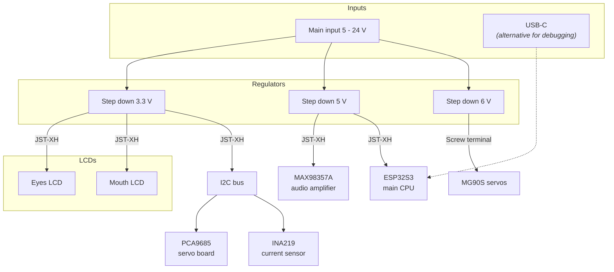

# Powering the robot

## ⚡ Main power input

Input range: 5 - 24 V (common range for all the step down converters)

In reality I'll be using either either 12 V from USB-C PD or 6.8 - 12.6 V from 2S or 3S Li-Ion etc.

### 3.3 V rail

Source: 3V3 Step down, https://www.aliexpress.com/item/1005008257960729.html
Input range: 5 - 30 V
Output current: 1.6 A (continuous)

Used by:

- eyes LCD
- mouth/face round LCD
- PCA9685 servo board chip
- I2C bus

### 5 V rail

Source: 5V adjustable step down, https://www.laskakit.cz/mikro-step-down-menic--nastavitelny/
Input range: 4.5 - 24 V
Output current: 3 A (max)

Used by:

- ESP32S3 (but maybe I can switch to 3V3 directly?)
- MAX98357A I2S amp

### 5.8 V rail

Source: adjustable step down, https://www.laskakit.cz/step-down-menic-s-xl4005/
Input range: 5V - 32 V
Output current: 2.5 A continuous, 5 A max (with cooling)

Used by:

- servos
